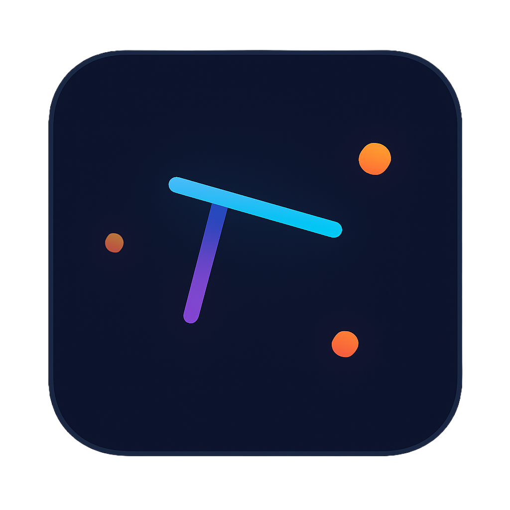

# Angle - AI-Powered Animation Studio

<div align="center">
  
  <br/>
  <p><em>Create stunning animations with the power of AI</em></p>
</div>

## 🎬 Transform Your Ideas into Animations

Angle is an AI-powered animation studio that turns your descriptions into beautiful, professional animations. Whether you're creating educational content, marketing videos, or artistic visualizations, Angle makes animation creation accessible to everyone.

## ✨ Key Features

- **AI-Powered Animation Generation**: Simply describe what you want, and watch it come to life
- **Real-time Preview**: See your animations as they're being created
- **Professional Quality**: Powered by advanced Manim animation engine
- **Intuitive Interface**: No animation experience required, it just a prompt away
- **Customizable Output**: Fine-tune your animations with easy-to-use controls
- **Add Multiple Audio**: Make the output your own with custom audio and export.

## 🚀 Quick Start

```bash
# Install dependencies
npm install

# Start the development server
npm run dev
```

Visit `http://localhost:3000` to start creating animations!

## 🎨 What You Can Create

- Educational animations and visualizations
- Marketing and promotional videos
- Artistic and creative animations
- Technical and scientific visualizations
- Add multiple audios and export as mp4
- And much more!

## 🛠️ Technical Stack

- Next.js for the frontend
- Google's Gemini AI for intelligent animation generation
- Manim community animation engine for professional output
- Real-time preview and editing capabilities

## 📝 Example Prompts

- "Create a smooth transition between two geometric shapes"
- "Animate a flowing water effect with particles"
- "Show a 3D object rotating with dynamic lighting"
- "Create an abstract pattern that morphs and evolves"

## 🔧 Requirements

- Node.js (v18 or higher)
- Python 3.7+
- Manim community edition

## 📄 License

MIT